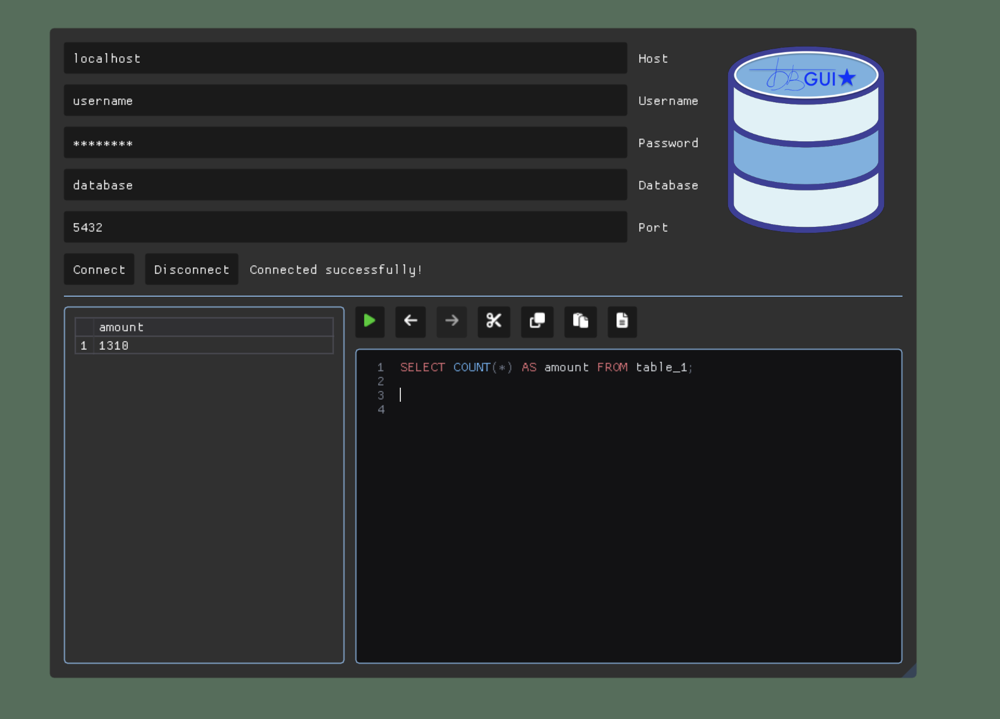

What's this? It's a new repository which is currently in a build phase!

What project stands behind this repository? A really cool immediate mode graphical user interface for **database** management using most popular RDBMS and modified ImGui library for cool designs! 

The goals are: 1) easily portable into other projects, 2) functionality over a basic one, 3) cross platform 

**Only MacOS is currently supported**

## Current stage of the project:

- Database connection via credentials (host, username, password, database, port)

- SQL query execution editor console, with a little of options and table child window

