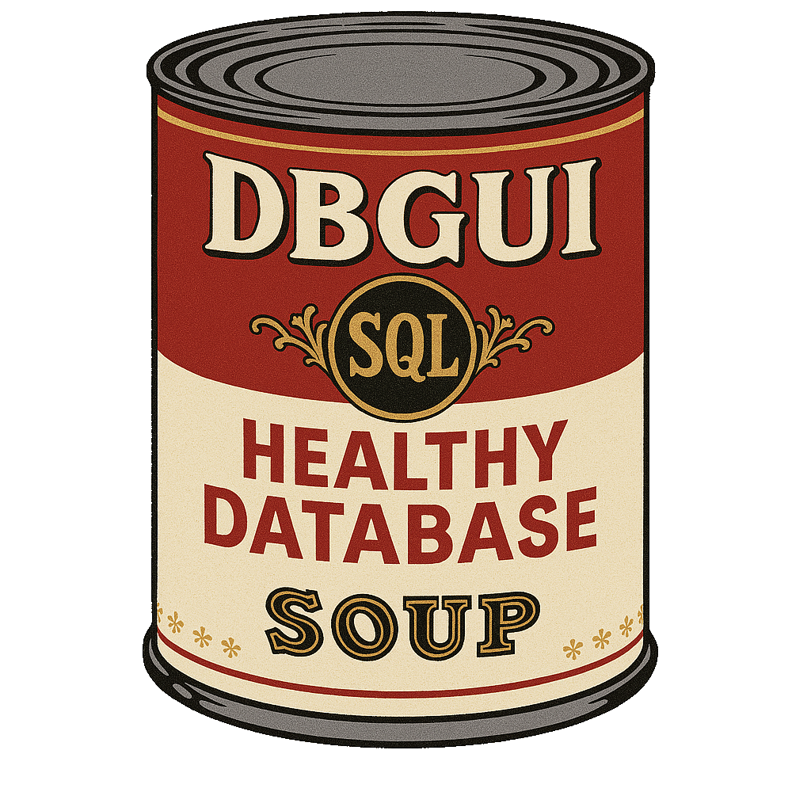

DBGui  —  client application with an Immediate Mode GUI interface for managing and administering personal databases. The application supports MacOS and MariaDB/MySQL databases. The program is written in Objective-C++ and uses the following libraries: ImGui (with modifications), MariaDB, MySQL, curl, openssl, rapidjson and others. The main idea behind communication with the database is to implement a server backend and frontend, where the C++ client uses curl requests to the server written in Go, which directly executes requests to the database.

## Goals

- Real-time database management, easily portable into other projects, cross-platform 
- erforming administrative tasks using an intuitive interface, functionality over a basic one
- Testing and demonstrating the principles of client-server interaction

## Current stage

- Database connection via credentials **(host, username, password, database, port)**
- SQL query execution editor console, with a little of options and tables child window

  
   

---

    

